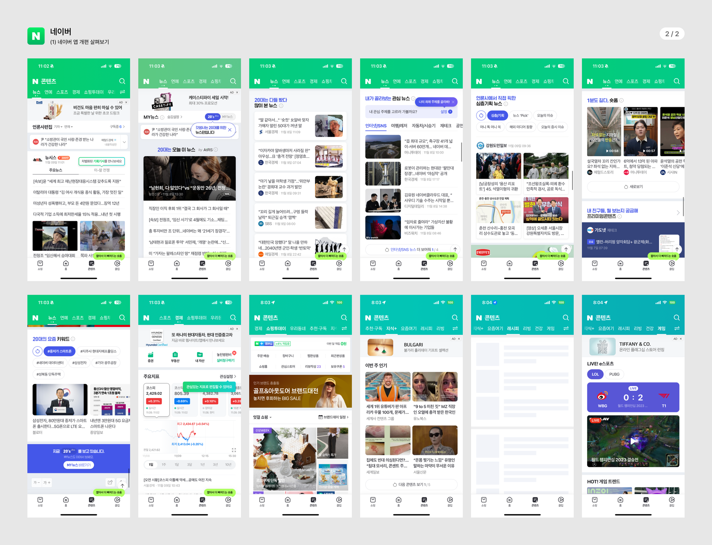
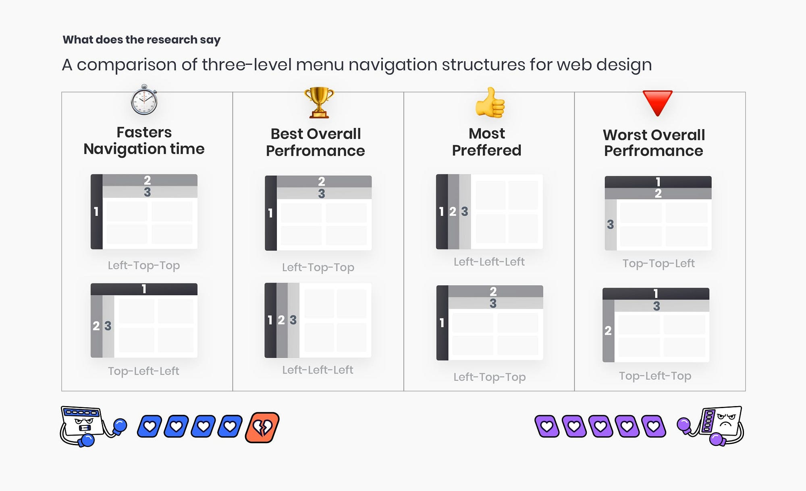

# 프론트엔드 개발자가 바라보는 UI와 UX

## 0. 개발자가 왜 UI와 UX를 알아야 될까?

글을 시작하기 전에, "프론트엔드 개발자가 왜 UI와 UX를 알아야 할까?"라는 질문에 대한 답을 먼저 살펴보겠습니다.

언뜻 생각하면 개발과 디자인은 거리가 먼 것처럼 느껴집니다.

하지만 프론트엔드 개발자는 '사용자가 직접 보고 상호작용하는 화면을 구현'하는 역할과 '사용자에게 좋은 경험을 제공할 책임'을 가지고 있습니다.
형편없는 UI를 그대로 구현해 사용자에게 나쁜 UX를 제공하고 디자이너에게 모든 책임을 돌리는 것은 좋은 개발자가 아닙니다.

따라서 프론트엔드 개발자는 디자이너와 적극적으로 소통하며 디자인을 실제 코드에 기술적으로 잘 구현할 수 있어야 합니다. 또한 디자인 요소들이 사용자에게 어떤 경험을 주는지 이해하고, 그에 맞게 화면을 구성할 수 있어야 합니다.

이를 위해서는 개발자 또한 UI와 UX에 대한 깊은 이해가 필요합니다.

## 1. UI(User Interface)와 UX(User Experience)

UI는 사용자가 제품을 사용할 때 보거나 상호작용하는 시각적 요소입니다. 색상, 타이포그래피, 레이아웃, 아이콘 등이 여기에 포함됩니다.

UX는 사용자가 제품이나 서비스를 사용하면서 느끼는 감정입니다. 어떠한 서비스가 편하다, 쉽다, 친근하다 등의 감정을 느끼는 것이 여기에 포함됩니다.

UI와 UX는 밀접하게 연관되어 있습니다. UI는 사용자가 제품과 상호작용하는 시각적 요소를 담당하고, UX는 사용자 경험을 책임집니다. 좋은 UI는 긍정적인 UX로 이어지고, UX는 UI의 품질을 평가합니다.

최근 많은 서비스들이 기능적이면서 아름다운 UI를 설계해 사용자들에게 긍정적인 경험을 제공하는 것에 집중하고 있습니다.
이에 사용자들은 더욱 편리하고 직관적인 경험을 기대하고 있으며, 성능뿐 아니라 사용자 중심의 디자인 또한 서비스 품질을 결정하는 중요한 요소가 되었습니다.
이에 발맞춰 프론트엔드 개발자는 기능적으로 훌륭하면서 시각적으로 아름다운 디자인을 구현해 사용자 경험을 증진시켜야 합니다.

## 2. 좋은 UI 설계의 원칙

좋은 UI(User Interface) 설계는 단순히 시각적으로 아름다운 요소를 만드는 것이 아닙니다. UI 설계의 핵심은 사용자가 쉽게 이해하고 상호작용할 수 있는 명확하고 직관적인 인터페이스를 제공하는 것입니다. 사용자는 불편함 없이 목적을 달성할 수 있어야 하며, UI의 여러 요소가 유기적으로 조화를 이뤄야 합니다.

### 2.1. 일관성

일관성은 UI 설계의 핵심 원칙입니다. 모든 UI 요소가 일관되게 설계되면 사용자가 쉽게 이해하고 예측할 수 있습니다.

#### 일관성의 적용 방법

- 색상: UI의 전체적인 색상은 일관되게 유지해야 합니다.
  일관된 색상을 사용함으로써 사용자는 브랜드 이미지를 직관적으로 파악할 수 있고, 사용자가 어디에 집중해야 하는지 쉽게 파악할 수 있습니다.

- 글꼴: 텍스트 크기와 스타일은 사용자가 읽기 쉽도록 구성해야 합니다.
  가독성 좋은 글꼴을 사용함으로써 사용자는 쉽게 정보를 전달받을 수 있습니다.

- 버튼과 아이콘: 같은 종류의 버튼과 아이콘은 동일한 크기와 모양을 유지해야 합니다.
  크기와 모양을 통일하면 사용자는 버튼과 아이콘의 의미와 기능을 쉽게 파악할 수 있습니다.

아래는 일관된 UI를 보여주는 네이버 모바일 웹 화면입니다.
색상과 글꼴이 통일되어 있으며, 각 버튼과 아이콘의 크기와 모양이 동일합니다.
이를 통해 사용자는 브랜드 이미지를 직관적으로 파악할 수 있고, 각 화면에서 어디에 집중해야 하는지 쉽게 파악할 수 있습니다.

### 2.2. 명확한 네비게이션 제공

네비게이션은 사용자가 제품 내에서 필요한 정보를 쉽게 찾도록 돕는 중요한 요소입니다.
잘 설계된 네비게이션은 사용자가 원하는 정보를 빠르게 찾을 수 있도록 돕고, 사용자가 혼란스러워하지 않도록 돕습니다.

#### 네비게이션 설계의 원칙

- 직관성: 메뉴 항목은 간결하고 명확하게 라벨링돼야 합니다.
  직관적이지 않은 네비게이션은 사용자가 원하는 정보를 찾기 어렵게 합니다.

- 가시성: 사용자가 현재 위치를 쉽게 파악할 수 있어야 합니다.
  잘 구성된 내비게이션은 사용자가 어느 탭에 있는지 쉽게 파악할 수 있게 합니다.

아래는 내비게이션 구성에 따른 사용자 경험의 차이를 보여주는 예시입니다.
이처럼 내비게이션 바의 위치에 따라 사용자는 원하는 것을 쉽게 찾을 수도, 그렇지 않을 수도 있습니다.

### 2.3. 즉각적인 피드백 제공

사용자는 인터페이스와 상호작용할 때 즉각적인 피드백을 원합니다. 피드백이 없으면 사용자는 혼란을 느낄 수 있습니다.
대표적인 피드백 제공 방식은 다음과 같습니다.

- 시각적 피드백: 버튼 호버, 클릭 시 색상이 변하는 등 시각적으로 변화를 줘야 합니다.
  [시각적 피드백](<./assets/Screen Recording 2024-10-28 at 5.52.51 PM.mov>)

- 음향 피드백: 작업 완료 시 소리로 알림을 제공할 수 있습니다.

- 텍스트 피드백: 오류가 발생했을 때 구체적인 설명을 제공해야 합니다.
  [텍스트 피드백](<./assets/Screen Recording 2024-10-28 at 5.55.07 PM.mov>)

## 3. 훌륭한 UX 설계의 방법

훌륭한 UX(User Experience) 설계는 사용자가 제품을 사용하는 과정에서 겪는 경험을 향상시키는 것을 목표로 합니다. UX 설계는 단순히 사용성을 개선하는 것을 넘어서 사용자의 감정까지 고려해야 합니다.

### 3.1. 사용자 조사

사용자 조사는 UX 설계 과정의 첫 단계로, 실제 사용자들의 요구와 기대를 이해하는 데 필수적입니다. 이를 통해 사용자의 불편함을 해결할 수 있는 정보를 수집합니다.

#### 사용자 조사 방법

- 설문조사: 대규모 사용자 집단에서 정량적인 데이터를 수집합니다.

- 심층 인터뷰: 소수의 사용자와 1:1로 대화해 심리적 상태를 파악합니다.

- 행동 분석: 사용자가 제품을 사용할 때의 행동 데이터를 분석합니다.

- 관찰: 사용자가 제품을 사용하는 과정을 직접 관찰합니다.

### 3.2. 프로토타이핑 및 테스트

프로토타입은 제품의 구조와 흐름을 미리 설계하고 사용자의 피드백을 반영하는 과정입니다.

#### 프로토타입의 종류

- 저충실도 프로토타입: 종이 스케치나 와이어프레임으로 간단하게 표현합니다.

- 고충실도 프로토타입: 실제 제품에 가까운 디지털 모델로 상호작용을 시뮬레이션 합니다.

### 3.3. 접근성

접근성은 다양한 사용자, 특히 장애가 있는 사용자도 제품을 문제없이 사용할 수 있도록 설계하는 것입니다.
접근성의 요소는 다음과 같습니다.

- 색상 대비: 텍스트는 높은 대비의 색상으로 표시해야 합니다.

- 스크린 읽기 지원: 시각 장애인을 위한 음성 읽기 기능을 제공해야 합니다.

- 키보드 네비게이션: 모든 UI 요소는 키보드로도 탐색할 수 있어야 합니다.

## 4. 디지털 성공을 위한 UI와 UX의 중요성

UI와 UX는 각각 독립적이지만 상호 보완적인 관계로 작동합니다. UI는 사용자가 제품과 시각적으로 상호작용하는 요소이고, UX는 사용자의 전체 경험을 관리하는 포괄적인 개념입니다.

또한 둘은 디지털 제품과 서비스의 성공에 필수적인 요소입니다. 사용자 기대가 높아짐에 따라 기능뿐만 아니라 사용자가 쉽게 이해하고 편리하게 사용할 수 있는 UI와 긍정적인 UX를 제공하는 것이 중요합니다.

UI와 UX는 서로 조화를 이루어야 합니다. 시각적으로 매력적인 UI는 사용자가 제품을 쉽게 접근하고 이해하는 데 도움을 주고, UX는 그 사용 경험을 관리합니다. 이 두 가지 요소가 조화를 이룰 때 사용자는 제품과 긍정적인 관계를 형성하게 됩니다.
